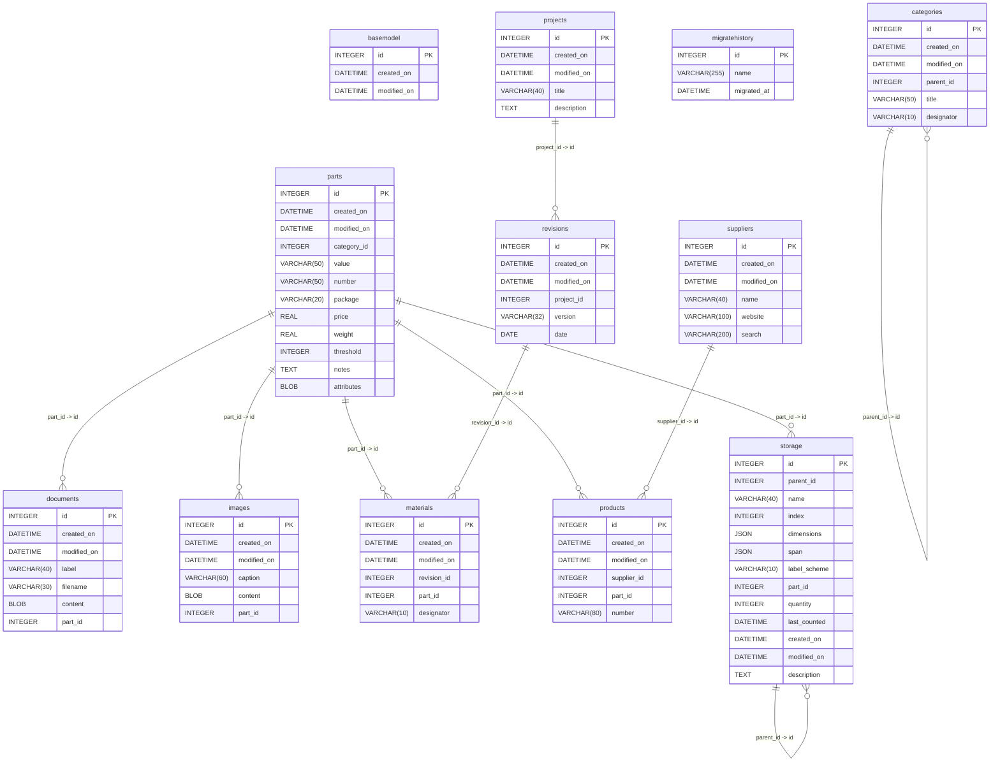

# Database Schema Overview: `parts.dev.sqlite`

This document provides a human-readable extraction and analysis of the SQLite database located at `C:\Hobbies\Inventory\BomShelter\FastAPI\parts.dev.sqlite`.

## Summary Statistics

| Table Name       | Row Count | Primary Key | Foreign Keys | Description / Purpose |
| :--------------- | :-------- | :---------- | :----------- | :-------------------- |
| `basemodel`      | 0         | `id`        | 0            | Schema table          |
| `categories`     | 161       | `id`        | 1            | Schema table          |
| `documents`      | 24        | `id`        | 1            | Schema table          |
| `images`         | 114       | `id`        | 1            | Schema table          |
| `materials`      | 153       | `id`        | 2            | Schema table          |
| `migratehistory` | 6         | `id`        | 0            | Schema table          |
| `parts`          | 463       | `id`        | 0            | Schema table          |
| `products`       | 455       | `id`        | 2            | Schema table          |
| `projects`       | 2         | `id`        | 0            | Schema table          |
| `revisions`      | 5         | `id`        | 1            | Schema table          |
| `storage`        | 664       | `id`        | 2            | Schema table          |
| `suppliers`      | 10        | `id`        | 0            | Schema table          |

---

## Entity-Relationship Diagram (ERD)



---

## Detailed Table Schemas

### Table: `basemodel` (Rows: 0)

**Columns:**

| Column        | Type       | Not Null | Default | PK   | Notes |
| :------------ | :--------- | :------- | :------ | :--- | :---- |
| `id`          | `INTEGER`  | Yes      | -       | Yes  |       |
| `created_on`  | `DATETIME` | Yes      | -       | No   |       |
| `modified_on` | `DATETIME` | No       | -       | No   |       |

**SQL Definition:**

```sql
CREATE TABLE "basemodel" ("id" INTEGER NOT NULL PRIMARY KEY, "created_on" DATETIME NOT NULL, "modified_on" DATETIME)
```

---

### Table: `categories` (Rows: 161)

**Columns:**

| Column        | Type          | Not Null | Default | PK   | Notes |
| :------------ | :------------ | :------- | :------ | :--- | :---- |
| `id`          | `INTEGER`     | Yes      | -       | Yes  |       |
| `created_on`  | `DATETIME`    | Yes      | -       | No   |       |
| `modified_on` | `DATETIME`    | No       | -       | No   |       |
| `parent_id`   | `INTEGER`     | No       | -       | No   |       |
| `title`       | `VARCHAR(50)` | Yes      | -       | No   |       |
| `designator`  | `VARCHAR(10)` | No       | -       | No   |       |

**Foreign Keys:**

- Column `parent_id` &rarr; References `categories(id)` (On Update: NO ACTION, On Delete: NO ACTION)

**SQL Definition:**

```sql
CREATE TABLE "categories" ("id" INTEGER NOT NULL PRIMARY KEY, "created_on" DATETIME NOT NULL, "modified_on" DATETIME, "parent_id" INTEGER, "title" VARCHAR(50) NOT NULL, "designator" VARCHAR(10), FOREIGN KEY ("parent_id") REFERENCES "categories" ("id"))
```

---

### Table: `documents` (Rows: 24)

**Columns:**

| Column        | Type          | Not Null | Default | PK   | Notes |
| :------------ | :------------ | :------- | :------ | :--- | :---- |
| `id`          | `INTEGER`     | Yes      | -       | Yes  |       |
| `created_on`  | `DATETIME`    | Yes      | -       | No   |       |
| `modified_on` | `DATETIME`    | No       | -       | No   |       |
| `label`       | `VARCHAR(40)` | Yes      | -       | No   |       |
| `filename`    | `VARCHAR(30)` | Yes      | -       | No   |       |
| `content`     | `BLOB`        | Yes      | -       | No   |       |
| `part_id`     | `INTEGER`     | Yes      | -       | No   |       |

**Foreign Keys:**

- Column `part_id` &rarr; References `parts(id)` (On Update: NO ACTION, On Delete: NO ACTION)

**SQL Definition:**

```sql
CREATE TABLE "documents" ("id" INTEGER NOT NULL PRIMARY KEY, "created_on" DATETIME NOT NULL, "modified_on" DATETIME, "label" VARCHAR(40) NOT NULL, "filename" VARCHAR(30) NOT NULL, "content" BLOB NOT NULL, "part_id" INTEGER NOT NULL, FOREIGN KEY ("part_id") REFERENCES "parts" ("id"))
```

---

### Table: `images` (Rows: 114)

**Columns:**

| Column        | Type          | Not Null | Default | PK   | Notes |
| :------------ | :------------ | :------- | :------ | :--- | :---- |
| `id`          | `INTEGER`     | Yes      | -       | Yes  |       |
| `created_on`  | `DATETIME`    | Yes      | -       | No   |       |
| `modified_on` | `DATETIME`    | No       | -       | No   |       |
| `caption`     | `VARCHAR(60)` | Yes      | -       | No   |       |
| `content`     | `BLOB`        | Yes      | -       | No   |       |
| `part_id`     | `INTEGER`     | Yes      | -       | No   |       |

**Foreign Keys:**

- Column `part_id` &rarr; References `parts(id)` (On Update: NO ACTION, On Delete: NO ACTION)

**SQL Definition:**

```sql
CREATE TABLE "images" ("id" INTEGER NOT NULL PRIMARY KEY, "created_on" DATETIME NOT NULL, "modified_on" DATETIME, "caption" VARCHAR(60) NOT NULL, "content" BLOB NOT NULL, "part_id" INTEGER NOT NULL, FOREIGN KEY ("part_id") REFERENCES "parts" ("id"))
```

---

### Table: `materials` (Rows: 153)

**Columns:**

| Column        | Type          | Not Null | Default | PK   | Notes |
| :------------ | :------------ | :------- | :------ | :--- | :---- |
| `id`          | `INTEGER`     | Yes      | -       | Yes  |       |
| `created_on`  | `DATETIME`    | Yes      | -       | No   |       |
| `modified_on` | `DATETIME`    | No       | -       | No   |       |
| `revision_id` | `INTEGER`     | Yes      | -       | No   |       |
| `part_id`     | `INTEGER`     | Yes      | -       | No   |       |
| `designator`  | `VARCHAR(10)` | Yes      | -       | No   |       |

**Foreign Keys:**

- Column `part_id` &rarr; References `parts(id)` (On Update: NO ACTION, On Delete: NO ACTION)
- Column `revision_id` &rarr; References `revisions(id)` (On Update: NO ACTION, On Delete: NO ACTION)

**SQL Definition:**

```sql
CREATE TABLE "materials" ("id" INTEGER NOT NULL PRIMARY KEY, "created_on" DATETIME NOT NULL, "modified_on" DATETIME, "revision_id" INTEGER NOT NULL, "part_id" INTEGER NOT NULL, "designator" VARCHAR(10) NOT NULL, FOREIGN KEY ("revision_id") REFERENCES "revisions" ("id"), FOREIGN KEY ("part_id") REFERENCES "parts" ("id"))
```

---

### Table: `migratehistory` (Rows: 6)

**Columns:**

| Column        | Type           | Not Null | Default | PK   | Notes |
| :------------ | :------------- | :------- | :------ | :--- | :---- |
| `id`          | `INTEGER`      | Yes      | -       | Yes  |       |
| `name`        | `VARCHAR(255)` | Yes      | -       | No   |       |
| `migrated_at` | `DATETIME`     | Yes      | -       | No   |       |

**SQL Definition:**

```sql
CREATE TABLE "migratehistory" ("id" INTEGER NOT NULL PRIMARY KEY, "name" VARCHAR(255) NOT NULL, "migrated_at" DATETIME NOT NULL)
```

---

### Table: `parts` (Rows: 463)

**Columns:**

| Column        | Type          | Not Null | Default | PK   | Notes |
| :------------ | :------------ | :------- | :------ | :--- | :---- |
| `id`          | `INTEGER`     | Yes      | -       | Yes  |       |
| `created_on`  | `DATETIME`    | Yes      | -       | No   |       |
| `modified_on` | `DATETIME`    | No       | -       | No   |       |
| `category_id` | `INTEGER`     | Yes      | -       | No   |       |
| `value`       | `VARCHAR(50)` | Yes      | -       | No   |       |
| `number`      | `VARCHAR(50)` | Yes      | -       | No   |       |
| `package`     | `VARCHAR(20)` | No       | -       | No   |       |
| `price`       | `REAL`        | No       | -       | No   |       |
| `weight`      | `REAL`        | No       | -       | No   |       |
| `threshold`   | `INTEGER`     | Yes      | -       | No   |       |
| `notes`       | `TEXT`        | Yes      | -       | No   |       |
| `attributes`  | `BLOB`        | Yes      | -       | No   |       |

**SQL Definition:**

```sql
CREATE TABLE parts (
    "id" INTEGER NOT NULL PRIMARY KEY,
    "created_on" DATETIME NOT NULL,
    "modified_on" DATETIME,
    "category_id" INTEGER NOT NULL,
    "value" VARCHAR(50) NOT NULL,
    "number" VARCHAR(50) NOT NULL,
    "package" VARCHAR(20),
    "price" REAL,
    "weight" REAL,
    "threshold" INTEGER NOT NULL,
    "notes" TEXT NOT NULL,
    "attributes" BLOB NOT NULL
)
```

---


### Table: `products` (Rows: 455)

**Columns:**

| Column        | Type          | Not Null | Default | PK   | Notes |
| :------------ | :------------ | :------- | :------ | :--- | :---- |
| `id`          | `INTEGER`     | Yes      | -       | Yes  |       |
| `created_on`  | `DATETIME`    | Yes      | -       | No   |       |
| `modified_on` | `DATETIME`    | No       | -       | No   |       |
| `supplier_id` | `INTEGER`     | Yes      | -       | No   |       |
| `part_id`     | `INTEGER`     | Yes      | -       | No   |       |
| `number`      | `VARCHAR(80)` | Yes      | -       | No   |       |

**Foreign Keys:**

- Column `part_id` &rarr; References `parts(id)` (On Update: NO ACTION, On Delete: NO ACTION)
- Column `supplier_id` &rarr; References `suppliers(id)` (On Update: NO ACTION, On Delete: NO ACTION)

**SQL Definition:**

```sql
CREATE TABLE "products" ("id" INTEGER NOT NULL PRIMARY KEY, "created_on" DATETIME NOT NULL, "modified_on" DATETIME, "supplier_id" INTEGER NOT NULL, "part_id" INTEGER NOT NULL, "number" VARCHAR(80) NOT NULL, FOREIGN KEY ("supplier_id") REFERENCES "suppliers" ("id"), FOREIGN KEY ("part_id") REFERENCES "parts" ("id"))
```

---

### Table: `projects` (Rows: 2)

**Columns:**

| Column        | Type          | Not Null | Default | PK   | Notes |
| :------------ | :------------ | :------- | :------ | :--- | :---- |
| `id`          | `INTEGER`     | Yes      | -       | Yes  |       |
| `created_on`  | `DATETIME`    | Yes      | -       | No   |       |
| `modified_on` | `DATETIME`    | No       | -       | No   |       |
| `title`       | `VARCHAR(40)` | Yes      | -       | No   |       |
| `description` | `TEXT`        | Yes      | -       | No   |       |

**SQL Definition:**

```sql
CREATE TABLE "projects" ("id" INTEGER NOT NULL PRIMARY KEY, "created_on" DATETIME NOT NULL, "modified_on" DATETIME, "title" VARCHAR(40) NOT NULL, "description" TEXT NOT NULL)
```

---

### Table: `revisions` (Rows: 5)

**Columns:**

| Column        | Type          | Not Null | Default | PK   | Notes |
| :------------ | :------------ | :------- | :------ | :--- | :---- |
| `id`          | `INTEGER`     | Yes      | -       | Yes  |       |
| `created_on`  | `DATETIME`    | Yes      | -       | No   |       |
| `modified_on` | `DATETIME`    | No       | -       | No   |       |
| `project_id`  | `INTEGER`     | Yes      | -       | No   |       |
| `version`     | `VARCHAR(32)` | Yes      | -       | No   |       |
| `date`        | `DATE`        | Yes      | -       | No   |       |

**Foreign Keys:**

- Column `project_id` &rarr; References `projects(id)` (On Update: NO ACTION, On Delete: NO ACTION)

**SQL Definition:**

```sql
CREATE TABLE "revisions" ("id" INTEGER NOT NULL PRIMARY KEY, "created_on" DATETIME NOT NULL, "modified_on" DATETIME, "project_id" INTEGER NOT NULL, "version" VARCHAR(32) NOT NULL, "date" DATE NOT NULL, FOREIGN KEY ("project_id") REFERENCES "projects" ("id"))
```

---

### Table: `storage` (Rows: 664)

**Columns:**

| Column         | Type          | Not Null | Default | PK   | Notes |
| :------------- | :------------ | :------- | :------ | :--- | :---- |
| `id`           | `INTEGER`     | Yes      | -       | Yes  |       |
| `parent_id`    | `INTEGER`     | No       | -       | No   |       |
| `name`         | `VARCHAR(40)` | Yes      | -       | No   |       |
| `index`        | `INTEGER`     | Yes      | -       | No   |       |
| `dimensions`   | `JSON`        | No       | -       | No   |       |
| `span`         | `JSON`        | No       | -       | No   |       |
| `label_scheme` | `VARCHAR(10)` | No       | -       | No   |       |
| `part_id`      | `INTEGER`     | No       | -       | No   |       |
| `quantity`     | `INTEGER`     | Yes      | -       | No   |       |
| `last_counted` | `DATETIME`    | No       | -       | No   |       |
| `created_on`   | `DATETIME`    | Yes      | -       | No   |       |
| `modified_on`  | `DATETIME`    | No       | -       | No   |       |
| `description`  | `TEXT`        | No       | -       | No   |       |

**Foreign Keys:**

- Column `part_id` &rarr; References `parts(id)` (On Update: NO ACTION, On Delete: NO ACTION)
- Column `parent_id` &rarr; References `storage(id)` (On Update: NO ACTION, On Delete: NO ACTION)

**SQL Definition:**

```sql
CREATE TABLE "storage" ("id" INTEGER NOT NULL PRIMARY KEY, "parent_id" INTEGER, "name" VARCHAR(40) NOT NULL, "index" INTEGER NOT NULL, "dimensions" JSON, "span" JSON, "label_scheme" VARCHAR(10), "part_id" INTEGER, "quantity" INTEGER NOT NULL, "last_counted" DATETIME, "created_on" DATETIME NOT NULL, "modified_on" DATETIME, "description" TEXT, FOREIGN KEY ("parent_id") REFERENCES "storage" ("id"), FOREIGN KEY ("part_id") REFERENCES "parts" ("id"))
```

---

### Table: `suppliers` (Rows: 10)

**Columns:**

| Column        | Type           | Not Null | Default | PK   | Notes |
| :------------ | :------------- | :------- | :------ | :--- | :---- |
| `id`          | `INTEGER`      | Yes      | -       | Yes  |       |
| `created_on`  | `DATETIME`     | Yes      | -       | No   |       |
| `modified_on` | `DATETIME`     | No       | -       | No   |       |
| `name`        | `VARCHAR(40)`  | Yes      | -       | No   |       |
| `website`     | `VARCHAR(100)` | Yes      | -       | No   |       |
| `search`      | `VARCHAR(200)` | Yes      | -       | No   |       |

**SQL Definition:**

```sql
CREATE TABLE "suppliers" ("id" INTEGER NOT NULL PRIMARY KEY, "created_on" DATETIME NOT NULL, "modified_on" DATETIME, "name" VARCHAR(40) NOT NULL, "website" VARCHAR(100) NOT NULL, "search" VARCHAR(200) NOT NULL)
```

---

### Table: `users`

**Columns:**

| Column        | Type          | Not Null | Default  | PK   | Notes |
| :------------ | :------------ | :------- | :------- | :--- | :---- |
| `id`          | `VARCHAR(36)` | Yes      | UUIDv7   | Yes  |       |
| `oidc_sub`    | `VARCHAR`     | Yes      | -        | No   | Indexed |
| `email`       | `VARCHAR`     | No       | -        | No   | Indexed |
| `username`    | `VARCHAR`     | No       | -        | No   |       |
| `role`        | `VARCHAR`     | Yes      | 'viewer' | No   | admin, designer, stocker, puller, analyst, viewer |
| `preferences` | `JSON`        | No       | `{}`     | No   | Account-bound user preferences |
| `created_at`  | `DATETIME`    | Yes      | UTC      | No   |       |
| `last_login`  | `DATETIME`    | Yes      | UTC      | No   |       |

**SQL Definition:**

```sql
CREATE TABLE "users" ("id" VARCHAR(36) NOT NULL PRIMARY KEY, "oidc_sub" VARCHAR NOT NULL UNIQUE, "email" VARCHAR UNIQUE, "username" VARCHAR, "role" VARCHAR DEFAULT 'viewer', "preferences" JSON, "created_at" DATETIME, "last_login" DATETIME)
```

---

## Indexes Summary

| Index Name             | Table        | SQL Definition                                                       |
| :--------------------- | :----------- | :------------------------------------------------------------------- |
| `category_parent_id`   | `categories` | `CREATE INDEX "category_parent_id" ON "categories" ("parent_id")`    |
| `document_part_id`     | `documents`  | `CREATE INDEX "document_part_id" ON "documents" ("part_id")`         |
| `image_part_id`        | `images`     | `CREATE INDEX "image_part_id" ON "images" ("part_id")`               |
| `material_part_id`     | `materials`  | `CREATE INDEX "material_part_id" ON "materials" ("part_id")`         |
| `material_revision_id` | `materials`  | `CREATE INDEX "material_revision_id" ON "materials" ("revision_id")` |
| `product_part_id`      | `products`   | `CREATE INDEX "product_part_id" ON "products" ("part_id")`           |
| `product_supplier_id`  | `products`   | `CREATE INDEX "product_supplier_id" ON "products" ("supplier_id")`   |
| `revision_project_id`  | `revisions`  | `CREATE INDEX "revision_project_id" ON "revisions" ("project_id")`   |
| `storage_parent_id`    | `storage`    | `CREATE INDEX "storage_parent_id" ON "storage" ("parent_id")`        |
| `storage_part_id`      | `storage`    | `CREATE INDEX "storage_part_id" ON "storage" ("part_id")`            |